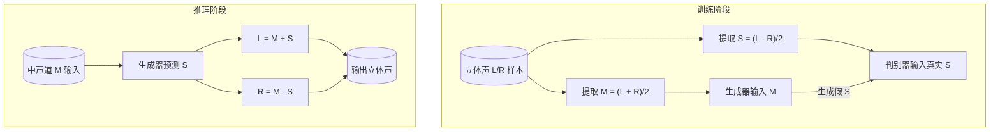

## 📄 项目需求文档
**项目名称**：中声道→侧声道 AI 预测 & GAN 立体声重构
**目标**：
- 利用 GAN（生成对抗网络）从单声道音频预测侧声道信号
- 根据公式构建立体声输出：
  ```
  L = M + S
  R = M - S
  ```
- 可在 macOS + conda 环境下运行，支持中国大陆 pip 镜像加速

**功能需求**：
1. **数据准备**
   - 输入：立体声音频数据集（WAV/FLAC等）
   - 处理：提取中声道 M 和侧声道 S 用于训练
2. **模型**
   - 基于 PyTorch 实现的 GAN 架构
   - 生成器：接受 M 特征生成 S
   - 判别器：区分真实 S 与生成的 S
3. **训练**
   - 使用优化器 Adam
   - 损失函数：BCE Loss（交叉熵）
   - 支持 Apple Silicon GPU (MPS) 加速
4. **推理**
   - 给单声道音频 M → 输出预测侧声道 S → 合成立体声 L/R
5. **可视化与验证**
   - 训练过程中保存 Loss 曲线
   - 测试样例合成立体声并播放/保存文件

**非功能需求**：
- 兼容 macOS 10.15+，支持 M1/M2/M3 芯片
- 优先使用 conda 管理环境
- pip 使用中国大陆镜像源以加速下载

---

## 📄 操作文档

### 1️⃣ 系统 & 软件准备
#### 1.1 安装 Conda（推荐 Miniconda）
下载 Miniconda（轻量版 Conda）：
```bash
# 在 macOS 终端执行：
curl -O https://repo.anaconda.com/miniconda/Miniconda3-latest-MacOSX-arm64.sh
bash Miniconda3-latest-MacOSX-arm64.sh
```
安装完成后，执行：
```bash
source ~/.zshrc     # 或 source ~/.bashrc
conda --version     # 验证安装成功
```

---

### 2️⃣ 创建项目环境（使用 conda）
```bash
# 创建名为 ai_audio_gan 的环境，Python版本建议 >= 3.9
conda create -n ai_audio_gan python=3.10
conda activate ai_audio_gan
```

---

### 3️⃣ 配置中国大陆 pip 镜像
```bash
pip config set global.index-url https://pypi.tuna.tsinghua.edu.cn/simple
pip config set global.trusted-host pypi.tuna.tsinghua.edu.cn
```
这样 pip 下载就会走 **清华镜像**，速度更快。

---

### 4️⃣ 安装依赖
```bash
# 科学计算 & 工具库
pip install numpy matplotlib tqdm

# PyTorch（CPU版）
pip install torch torchvision torchaudio

# 如为 Apple Silicon 芯片，安装 PyTorch Metal加速版本
pip install torch torchvision torchaudio --extra-index-url https://download.pytorch.org/whl/metal.html
```

---

### 5️⃣ 项目目录结构
```plaintext
ai_audio_gan/
├── data/                # 数据集（立体声文件）
├── preprocess.py        # 音频处理：提取 M/S
├── model.py              # GAN 模型定义
├── train.py              # 训练脚本
├── inference.py          # 推理脚本
├── utils.py              # 工具函数（保存音频/绘图）
└── requirements.txt      # 依赖记录
```

---

### 6️⃣ 训练模型

#### 准备数据
将立体声音频文件（WAV/FLAC/MP3）放入 `data/` 目录。

**从视频中提取音频：**
```bash
# 提取为 WAV（无压缩）
ffmpeg -i video.mp4 -vn -acodec pcm_s16le output.wav

# 提取为 FLAC（无损压缩，体积更小）
ffmpeg -i video.mp4 -vn -acodec flac output.flac

# 批量提取当前目录所有 mp4 为 flac
for f in *.mp4; do ffmpeg -i "$f" -vn -acodec flac "${f%.mp4}.flac"; done

# 截取音频前 10 分钟（加快训练）
ffmpeg -i input.flac -t 600 -acodec flac output.flac
```

**检查音频是否符合要求：**
```bash
ffprobe -v error -show_entries stream=channels,sample_rate,duration -of compact your_audio.wav
```
输出 `channels=2` 表示立体声，符合训练要求。

#### 运行训练
```bash
conda activate ai_audio_gan
cd audio_stereo_gan
python train.py
```

#### 训练输出
| 文件 | 说明 |
|------|------|
| `gen.pth` | 生成器模型权重 |
| `disc.pth` | 判别器模型权重 |
| `loss_curve.png` | G/D 损失曲线图 |

#### 训练指标参考
| 参数 | 理想值 | 含义 |
|------|--------|------|
| D_loss | ≈ 0.5 | 判别器 50% 正确率，分不清真假 |
| G_loss | ≈ 0.7~1.0 | 生成器能稳定骗过判别器 |

**失败模式**
| D_loss | G_loss | 问题 |
|--------|--------|------|
| →0 | →∞ | 判别器过强 |
| →∞ | →0 | 生成器过强，输出单一模式 |

**成功标志**：两者在 0.5~1.0 区间稳定波动，不再单向下降或飙升。

#### 如何看损失曲线图
训练过程中会实时更新 `loss_curve.png`，通过曲线形态判断训练状态：

| 曲线形态 | 含义 | 状态 |
|----------|------|------|
| 两线交汇于 0.5~1.0 | 达到纳什均衡 | ✅ 成功 |
| D↓ G↑ 持续分离 | 判别器过强 | ❌ 需调参 |
| D↑ G↓ | 模式崩溃 | ❌ 需调参 |
| 两线剧烈震荡 | 训练不稳定 | ⚠️ 降低学习率 |

#### 保存训练成果
```bash
# 使用备份脚本（推荐）
./backup.sh v1        # 备份到 models/v1_20241203_153025/

# 或手动备份
mkdir -p models
cp gen.pth models/gen_$(date +%Y%m%d_%H%M%S).pth
```

使用备份模型推理：
```bash
python inference.py -i input.wav -m models/v1_20241203_153025/gen.pth
```

---

### 7️⃣ 推理生成立体声

#### 基本用法
```bash
python inference.py -i <输入单声道音频> -o <输出立体声音频>
```

#### 参数说明
| 参数 | 简写 | 默认值 | 说明 |
|------|------|--------|------|
| `--input` | `-i` | (必填) | 输入单声道音频文件 |
| `--output` | `-o` | `output_stereo.wav` | 输出立体声文件 |
| `--model` | `-m` | `gen.pth` | 生成器模型路径 |

#### 示例
```bash
# 基本推理
python inference.py -i test_mono.wav

# 指定输出文件和模型
python inference.py -i input.wav -o result.wav -m models/gen.pth
```

#### 推理输出
- `output_stereo.wav` - 生成的立体声音频
- `waveform_m.png` - 中声道波形图
- `waveform_s.png` - 预测侧声道波形图

---

### 8️⃣ 验证模型效果

使用已有的双声道音频验证模型质量，脚本会自动提取 M/S 并与预测结果对比。

#### 运行验证
```bash
python validate.py -i test_stereo.wav -m gen.pth
```

#### 参数说明
| 参数 | 简写 | 默认值 | 说明 |
|------|------|--------|------|
| `--input` | `-i` | (必填) | 原始双声道音频文件 |
| `--model` | `-m` | `gen.pth` | 生成器模型路径 |

#### 输出指标
| 指标 | 含义 | 理想值 |
|------|------|--------|
| MSE | 均方误差 | 越小越好 |
| 相关系数 | 预测与真实的相关性 | 越接近 1 越好 |

#### 评价标准
| 相关系数 | 评价 |
|----------|------|
| > 0.7 | ✅ 优秀 |
| 0.4 ~ 0.7 | ⚠️ 一般，可继续训练 |
| < 0.4 | ❌ 较差，需调整模型或数据 |

#### 验证输出
- `validation_result.png` - 波形对比图（原始 S / 预测 S / 差异）

---

### 9️⃣ Mermaid 训练+推理总览图


---

✅ 现在你有 **项目需求文档** 和 **操作文档**，一步步搭好环境并运行 GAN 训练，且全程适配 **conda** + **中国大陆镜像**。
